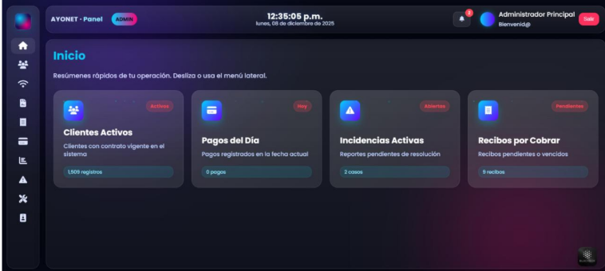
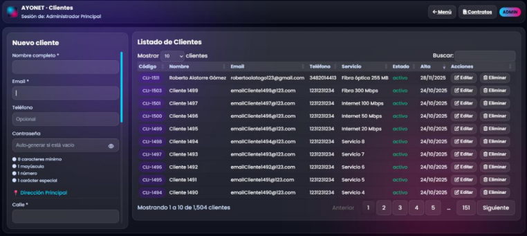
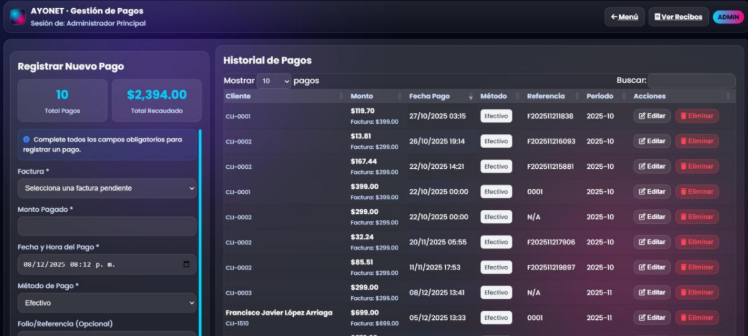
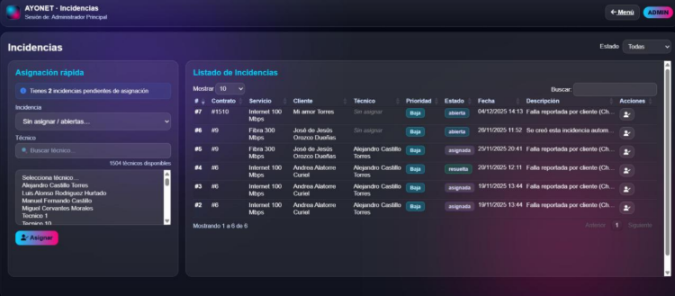

# AYONET – Internet Service Management System

AYONET is a web-based system designed to manage internet service provider operations.
The platform allows administrators, technicians, and vendors to manage customers, payments, contracts, and technical incidents efficiently.

## Technologies Used

* PHP
* PostgreSQL
* HTML / CSS
* JavaScript
* Composer

## Main Features

* Customer management
* Payment registration and tracking
* Service contract management
* Technical incident management
* Payment receipts and history
* Role-based system (Admin, Technician, Vendor)

## Database

The database structure can be found in:

database/proayonet.sql

## System Screenshots

### Login


### Dashboard



### Customer Management



### Payment Management



### Incident Management



## Installation

1. Clone the repository

```
git clone https://github.com/ingdani2901/AYONET.git
```

2. Import the database

```
database/proayonet.sql
```

3. Configure the database connection in the project.

4. Run the project on a local server (XAMPP, Laragon, etc.).

## Author

Daniela Sepúlveda
Computer Systems Engineering Student
